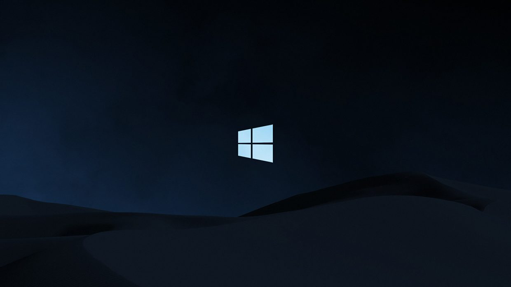

# Windows10-Start-Menu-Clone
A small and simple project in which I created the clone of Windows10 start menu using just HTML and CSS (grid layout)

 

# Idea
I got the idea by watching a Traversy Media tutorial on CSS Grid Layout.

 

# Contribution Trick
Firstly thanks for your interest to contribute in this project. Here is the [hyperlink](https://ahammadshawki8.github.io/Windows10-Start-Menu-Clone/) to the webpage. You can fork this repo, enhance the clone and then create an PR. If your code passes some simple checks, I will merge the PR.

 

# License
Details can be found in [LICENSE](LICENSE)